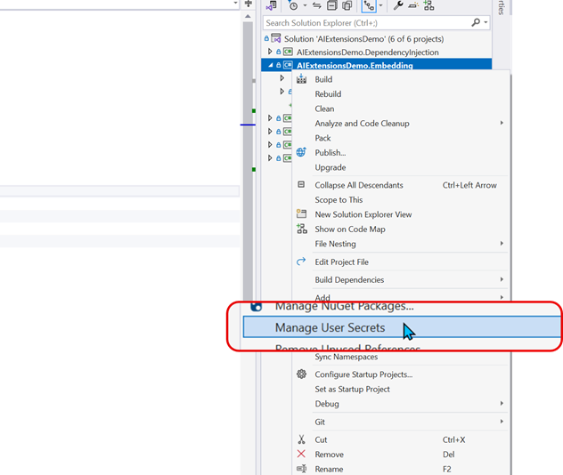

# Embedding

This project demonstrates the use of AI extensions for embedding functionalities within applications. The goal is to showcase how AI can be integrated to enhance the capabilities of software, providing more intelligent and responsive features. By leveraging AI, developers can create more dynamic and user-friendly applications that can adapt to various needs and scenarios.

## Configuration
 
### Ollama (local)
 
To use Ollama local model you need to install [Ollama Client](https://ollama.com/).
 Check the offcial documentation to know how run a local model.
 To configure the model you need to setup the `<model name>` value in the ChatClient creation:

``` C#
embeddingGenerator = new OllamaEmbeddingGenerator(
   new Uri("http://127.0.0.1:11434"),
   modelId: "<model name>");
```

### Azure OpenAI

The settings to configure model deployed in Azure OpenAI are stored in the user secret.
To modify the user secrets,  using the right-click menu' on the project in Visual Studio:



and add the following section:

``` json
{
    ...
    "AzureOpenAI": {
        "ApiKey": "<Azure OpenAI key>",
        "DeploymentName": "<deployment name>",
        "Endpoint": "<Azure OpenAI Endpoint>"
    },
    ...
}
```

where:

- `<Azure OpenAI Endpoint>` is the endpoint of the Azure OpenAI resource (you can retrieve it in the Azure Portal);
- `<Azure OpenAI key>` is one of the two keys you can find in the Azure OpenAI resource in Azure Portal;
- `<deployment name>` the name of the deployment in the Azure OpanAI resource you want to use.

### OpenAI

The settings to access to model OpenAI are stored in the user secret.
To modify the user secrets,  using the right-click menu' on the project in Visual Studio:


and add the following section:

``` json
{
  ...
  "OpenAI": {
    "ApiKey": "<OpenAI Key>",
    "ModelId": "<Model Name>"
  }
  ...
}
```

where:

- `<OpenAI key>` is a key you can generate in your OpenAI API account (see [API Authentication](https://platform.openai.com/docs/api-reference/authentication) for more details);
- `<Model Name>` is the name of the model you want use (for example `text-embedding-3-small`).

### GitHub Models

The settings to access to model hosted by GitHub are stored in the user secret.
To modify the user secrets,  using the right-click menu' on the project in Visual Studio:


and add the following section:

``` json
{
  ...
  "GitHubModel": {
    "Token": "<GitHub Token>",
    "Model": "<Model Name>",
    "Endpoint": "https://models.inference.ai.azure.com"
  },
  ...
}
```

where:

- `<GitHub Token>` is a personal access token generated in your GitHub profile (see [GitHub Tokens](https://github.com/settings/tokens) for more details);
- `<Model Name>` is the name of the model you want use (for example `Cohere-embed-v3-multilingual`). You can find the full list of the model available at [GitHub Models](https://github.com/marketplace?type=models).
